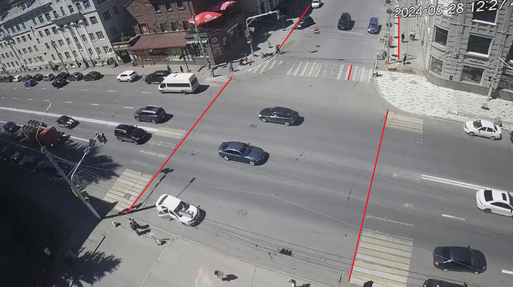
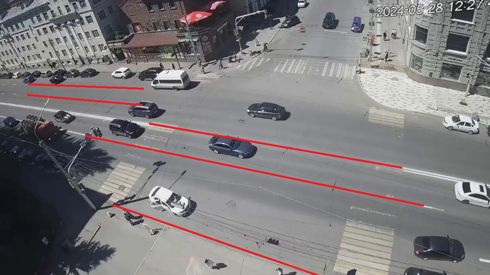
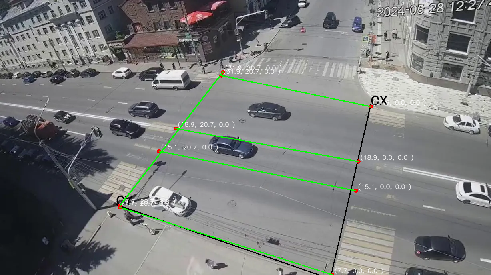
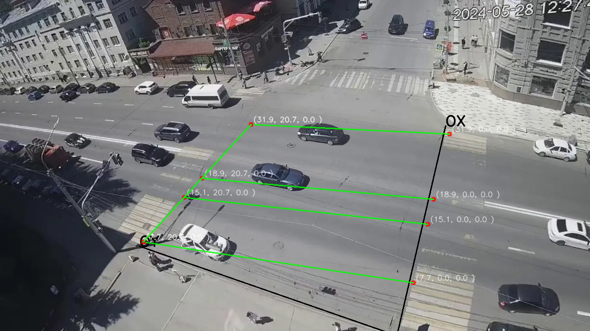

Калиборовка внутренних и внешних параметров камеры по одному изображению
-----------------

## Зависимости

Python 3.10

## Подготовка данных

1. Дисторсией
   https://veichta-geocalib.hf.space/
2. Углы Эйлера
   https://basmanovdaniil.github.io/GimbalLock/

## Калибровка
1. [Заполение матрицы поворота точками схода](./materials/manual/Составление%20матрицы%20поворота%20из%20точек%20схода.pdf)
### Ручная
   1. [Калибровка с помощью геометрических примитивов](materials/manual/calibration_camera_using_geometric.pdf)
   2. [Калибровка с помощью геометрических примитивов(дополнение)](materials/manual/calibration_camera_using_geometric_v2.pdf)

### Автокалибровка 
   1. [Автокалибровка с помощью точек схода](materials/auto/Калибровка%20на%20основе%20точек%20схода.pdf)

### Скорость
   1. [Вычисление скорости и калибровка по кривым линиям](materials/speed/Скорость.pdf)
## Входные данные
1. Точки схода по X
    
2. Точки схода по Y
   
3. Калибровочные линии 
   
## Результаты
1. Калибровка точка в точку с линейной функцией ошибки
   
2. Калибровка c использованием оптимизации модели с линейной функцией ошибки