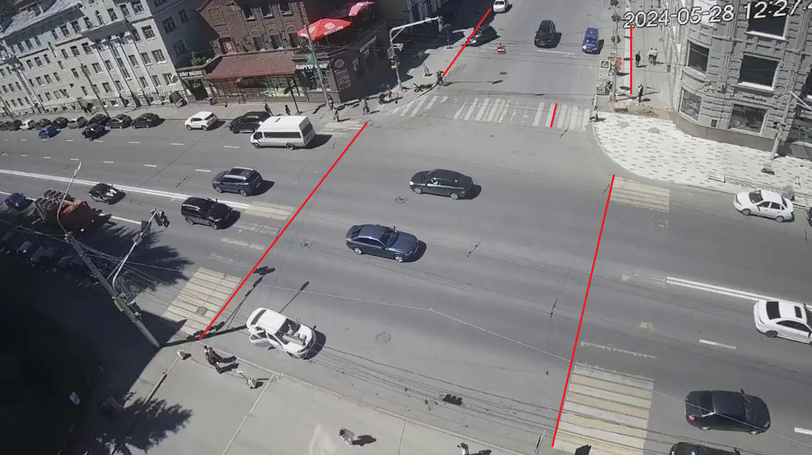
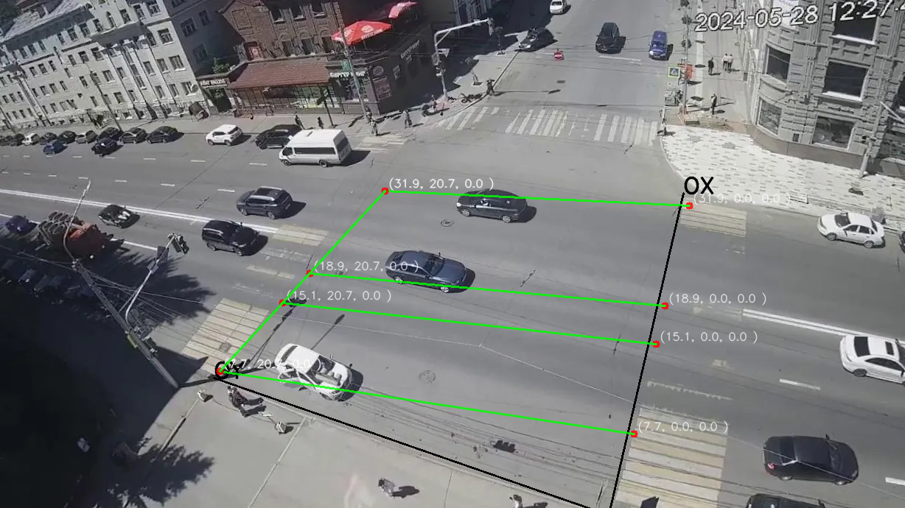

Калиборовка внутренних и внешних параметров камеры по одному изображению
-----------------

## Зависимости

Python 3.10

## Подготовка данных

1. Дисторсией
   https://veichta-geocalib.hf.space/
2. Углы Эйлера
   https://basmanovdaniil.github.io/GimbalLock/

## Калибровка

1. [Калибровка с помощью геометрических примитивов](./materials/main/calibration_camera_using_geometric.pdf)
2. [Калибровка с помощью геометрических примитивов(дополнение)](./materials/main/calibration_camera_using_geometric_v2.pdf)

## Входные данные
1. Точки схода по X
    
2. Точки схода по Y
   
3. Калибровочные линии 
   
## Результаты
1. Калибровка точка в точку с линейной функцией ошибки
   
2. Калибровка c использованием оптимизации модели с линейной функцией ошибки