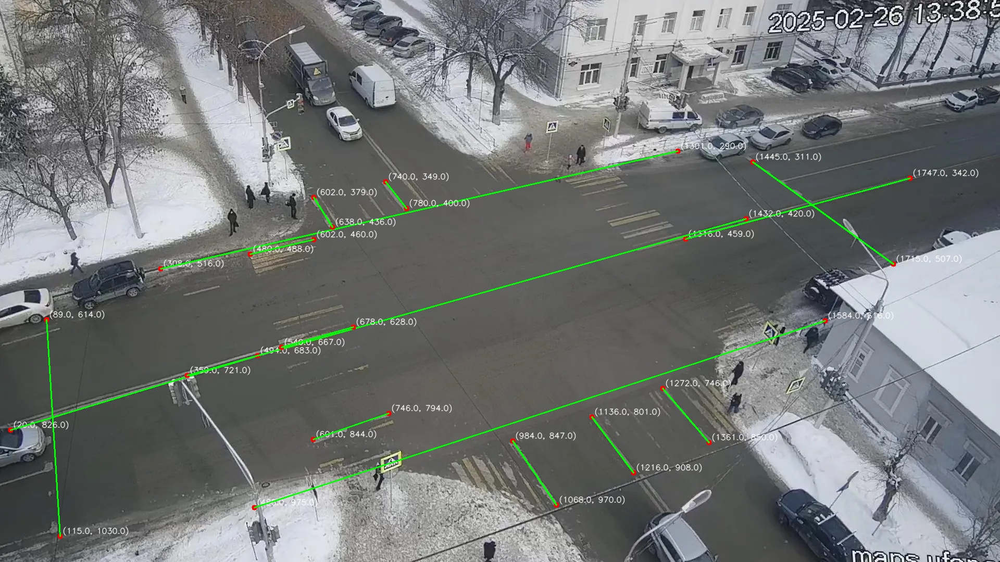

Калиборовка внутренних и внешних параметров камеры по одному изображению
-----------------

## Зависимости

Python 3.10

## Подготовка данных

1. Дисторсией
   https://veichta-geocalib.hf.space/
2. Углы Эйлера
   https://basmanovdaniil.github.io/GimbalLock/

## Калибровка
1. [Заполение матрицы поворота точками схода](literature/manual/Составление%20матрицы%20поворота%20из%20точек%20схода.pdf)
### Ручная
   1. [Калибровка с помощью геометрических примитивов](literature/manual/calibration_camera_using_geometric.pdf)
   2. [Калибровка с помощью геометрических примитивов(дополнение)](literature/manual/calibration_camera_using_geometric_v2.pdf)

### Автокалибровка 
   1. [Автокалибровка с помощью точек схода](literature/auto/Калибровка%20на%20основе%20точек%20схода.pdf)

### Скорость
   1. [Вычисление скорости и калибровка по кривым линиям](literature/speed/Скорость.pdf)
## Входные данные
__Перекресток Пушкина Аксакова__ 

## Результаты
__Перекресток Пушкина Аксакова(погрешность: 2.0856e-01)__: 
   
   